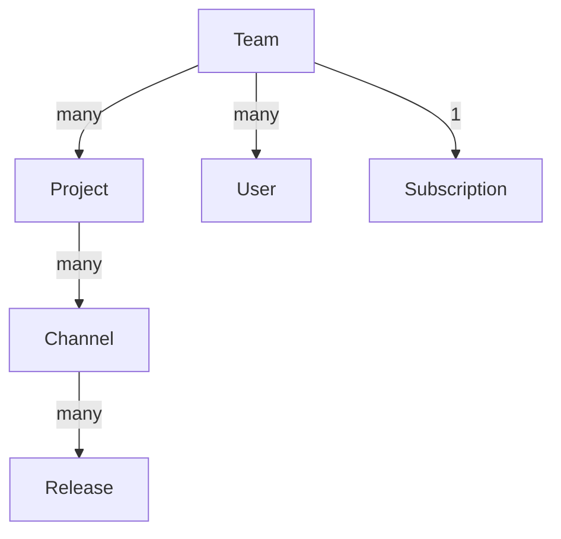
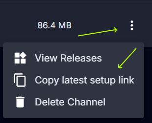
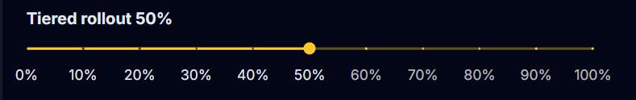

# Flow Details
<AppliesTo all />

## Authentication
<FlowLink /> supports OAuth, forms authentication, and API keys for authentication. You can use any of these methods to authenticate with the Flow service. The recommended method is to use OAuth, as it provides the most secure and flexible authentication mechanism.

To perform an interactive login use the `vpk login` command. This will persist your authentication locally inside of `~/.vpk`. For running commands without interaction, such as a CI/CD pipeline, you can specify the `--api-key` option to the `vpk` commands that interact with Flow. 

## Data Structure
A basic overview of the data structure used by <FlowLink /> is as follows:

The pricing model is linked to a team. Though a user can be a member of many teams, a user will only be able to create projects in a single free tier team (teams without a paid subscription). A team, contains projects. A project refers to a single application, more specificially a single package id. A project can have many channels, which are used to organize releases. A channel is a logical grouping of releases, such as "stable", "beta", or "alpha". Channels should also be used to separate different platforms such as "Windows", "macOS" and "Linux". Within a channel a release is made up of one ore more artifacts (the files created by running `vpk pack`), which are the actual files that are distributed to users. For a release to be considered valid it must contain at least the full release package as well as the corresponding Setup.exe file.

## Static Links
<FlowLink /> provides static links for each channel, and release. These links can be referred from your own website to direct user to download the latest release of an application, or to download a specific release. 

The most common will be the latest release for a given channel. On the channel list page you can click the ellipsis menu on the right side of the channel row and select "Copy latest setup link". This will copy a link to the latest setup installer for that channel to your clipboard. This URL will always point to the latest release for that channel, so you can use it in your own website or documentation.

You can also get direct link to specific releases. On the release details page there is a Release links section with buttons to copy links to installers at specific versions. 

For more advanced use cases see the `download/*` endpoints under the Releases section from [API](#api) section below. The API provides additional functionality to get links to specific artifacts or artifact types.

## Tiered Rollout
Tiered rollout is a feature of <FlowLink /> that allows you to gradually release a new version of your application to a subset of users. This is useful for testing new features or changes before rolling them out to all users. You can specify a rough percentage of users that should receive the new version by adjusting the slider on the release details page for a given release. 

When a user installs a Velopack application they are given a random ID. When the `UpdateManager` queries for updates, this ID is passed to the Flow service. To determine if a user should receive the new version of the application, the Flow service hashes this ID and checks if it falls within the percentage range specified for the release. If it does, the user will receive the new version of the application.

## API
<FlowLink /> offers a REST API for interacting with the service. There is an OpenAPI specification available at https://api.velopack.io/swagger that describes the API endpoints and their parameters. This API allows you to build your own automation tools that integrate with Velopack Flow.

`vpk` supports making direct calls against this API using the `vpk flow api` command. This command allows you to make GET, POST, PUT, and DELETE requests to the Flow API. You can use this command to automate tasks such as creating projects, uploading releases, and managing channels. 

Some sample commands for managing projects:
- Getting a list of projects: `vpk flow api -m GET -e "v1/projects/list"`
- Create a new project: `vpk flow api -m POST -e "v1/projects/create" -b '{"name": "My Project Name", "teamIdentifier": "Default Team", "packageId": "company.package.id"}'`
- Deleting a project: `vpk flow api -m DELETE -e "v1/projects/$($project.id)"`

For all of the available options see the [vpk CLI documentation](../reference/cli).

